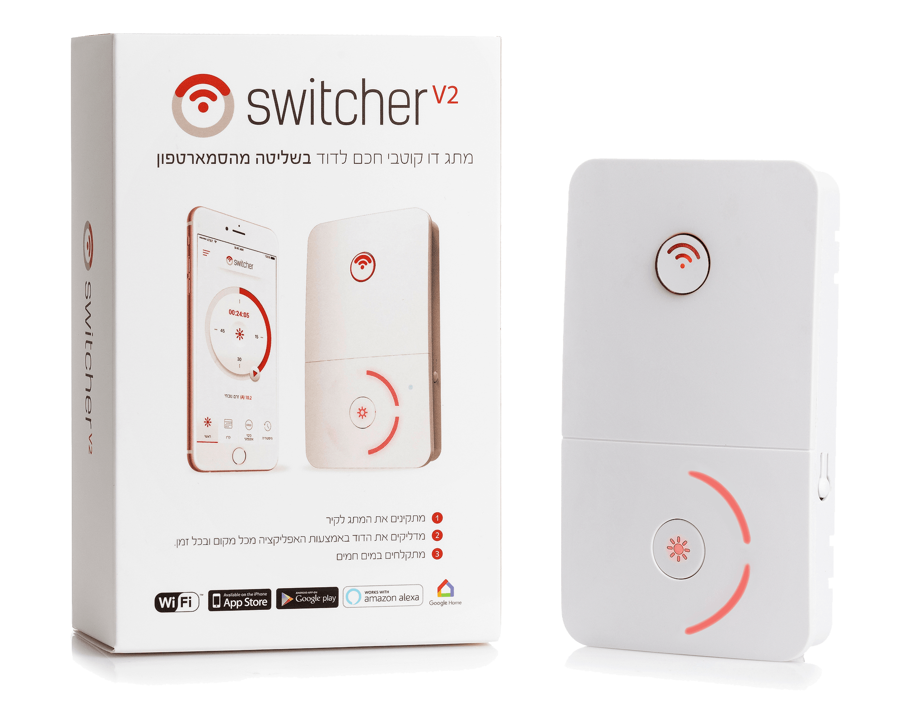
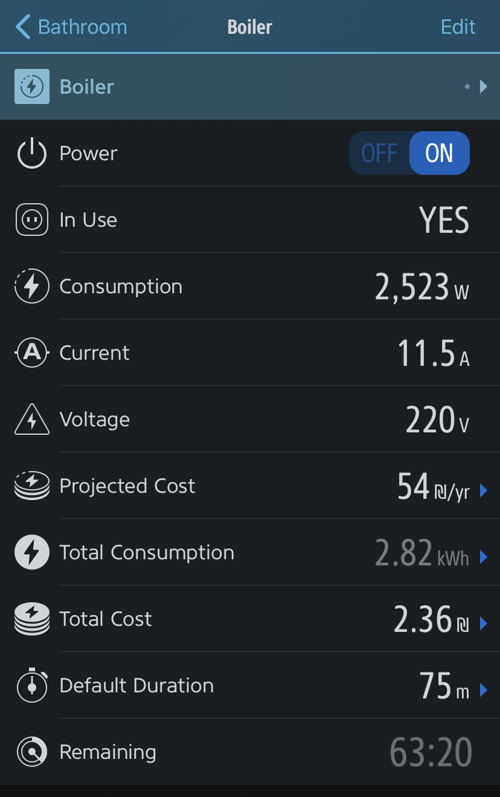

# homebridge-switcher-boiler

[](https://www.npmjs.com/package/homebridge-switcher-boiler)
[](https://www.npmjs.com/package/homebridge-switcher-boiler)<br>
[](https://github.com/homebridge/homebridge/wiki/Verified-Plugins) [](https://discord.gg/7DyabQ6)<br>
[](https://plugins.hoobs.org?ref=10876) [](https://support.hoobs.org?ref=10876)

[Homebridge](https://github.com/nfarina/homebridge) plugin for Switcher - Boiler / Water Heater

  

### Requirements

 &nbsp;
 &nbsp;


check with: `node -v` & `homebridge -V` and update if needed

## Description

The long waited plugin for the Switcher boiler/water-heater is here!<br>
Easily discovers your device automatically without any prior steps needed.<br>
**NO configuration needed, NO extraction of values or params, NO use of external scripts and method.**

The plugin will expose 1 switch accessory representing the Switcher. When first initializing the plugin, it will scan for devices and retrieve device ID and device IP and will store them for the next restart (in case the device won't be online when initializing homebridge).

## Features and Plans
This is the very first stage of the plugin, the implementation is very simple and straight forward.
Once I can be assure that this plugin is working as expected, I will start develop the following features:

- [x] Power Consumption (in Watts) in the Eve app.
- [x] History Storage: Store power consumption over time (Eve app)
- [x] Option for valve accessory - will give you the ability to control the auto-shutdown time and/or turn on the Switcher for a certain amount of time.

# Installation


This plugin is [HOOBS](https://hoobs.org/?ref=10876) certified and can be easily installed and configured through their UI.

If you don't use HOOBS (or Homebridge UI), keep reading:


1. Make sure you have Python installed (RasberryPi OS and HOOBS usually come with Python pre-installed)
2. Install homebridge using: `sudo npm install -g homebridge --unsafe-perm`
3. Install this plugin using: `sudo npm install -g homebridge-switcher-boiler`
4. Update your configuration file. See `config-sample.json` in this repository for a sample.

\* install from git: `sudo npm install -g git+https://github.com/nitaybz/homebridge-switcher-boiler.git`

## Config file

#### Easy config (required)

```
"accessories": [
    {
        "accessory": "SwitcherBoiler",
        "name": "Boiler"
    }
]
```

#### Advanced config (optional)

```
"accessories": [
    {
        "accessory": "SwitcherBoiler",
        "name": "Boiler",
        "accessoryType": "outlet",
        "pollingIntervalInSec": 60,
        "debug": false
    }
]
```

### Configurations Table

*advanced details below

|             Parameter            |                       Description                       | Required |  Default |   type   |
| -------------------------------- | ------------------------------------------------------- |:--------:|:--------:|:--------:|
| `accessory`             | always `"SwitcherBoiler"`                                 |     ✓    |     -    |  String  |
| `name`                  | Name for your Switcher accessory                        |     ✓    |     -    |  String  |
| `accessoryType`        | Type of Accessory (`"switch"`, `"outlet"`, `"valve"`). read more below...|         |     `"switch"`    |  String  |
| `pollingIntervalInSec`  |  Amount of time in Seconds to poll device state. default to 60 seconds. 0 for no polling.   |          |  `30` |  Integer |
| `debug`       |  When set to `true`, the plugin will produce extra logs for debugging purposes        |          |  `false` |  Boolean  |

# Advanced Control

### Auto Detect Configurations

The plugin will scan and search for your Switcher device in your network (No prior steps needed!). Once found, it will retrieve the device IP and device ID and store them locally to make sure it's available for the next time the system restarts in case the device won't be detectible.
It is especially useful for situations where the Switcher device is temporarily down or not connected during system reboot.


### Accessory Type & Version 1.1
In the new version (>= 1.1.0) there are a lot more exciting options for your Switcher!
First of all, I've added a lot of service to support both timer/auto-shutdown and getting information about the power consumption of the device.<br><br>
All the new services are available for any accessory type that you choose (in Eve app or most of 3rd party apps).
However, in Home app it is not possible to present an accessory with all those functionalities, especially since it doesn't support power consumption.<br>

To overcome this limit I gave you the possibility to choose what would be the best option for you to see in Home app:

#### Switch (default)
When you just want a normal switch (like version 1) and don't need anything else. (all services will still appear in 3rd party apps)

#### Outlet
Choose `"accessoryType": "outlet"` if you are most interested in the power consumption stats and automations. Outlet accessory will reveal the service "In Use" which will only be active if your bolier is ON and consume energy. it will not be active when the boiler has reached it's temperature limit and no power is used (even if the switcher is ON -  accessory will show on but not "in use").<br>
Choosing outlet will also track your power consumption.<br>
**Eve app only**: history and stats and will even calculate yearly costs after it collected enough data.


#### Water Valve
Choosing `"accessoryType": "valve"` will give you the possibility to control your auto-shutdown time from the Home app and therefore affect the time the device will be on before forcing shutdown.<br>
You should be **AWARE** that changing the duration time in HomeKit will affect in changing you auto-shutdown time in Switcher which will of course affect the auto-shutdown time even when you turn the device manually.

### New Services and Eve App

In version 1.1, a lot of new services are available in Eve app.<br>
check the following screenshot and explanations:<br><br>
<br>

*To reveal all the services, click on "Edit" in Eve app (top right in the accessory screen) and enable everything.

**In Use (Outlet only)** - Represent wether or not the boiler is heating and consuming energy.<br>
**Consumption** - Current consumption in Watts.<br>
**Current** - Electrical current (Ampere).<br>
**Voltage** - Always 220 volt when device is ON.<br>
**Projected Cost** - Eve calculations of predicted yealy cost based on Total consumption.<br>
**Total Consumption** - Total Consumption in kWh.<br>
**Total Cost** - Eve calculations of total costs with local currency.<br>
**Default Duration** - Auto-Shutdown time, affecting the Auto-Shutdown setting in Switcher app and the max heating duration. possible inputs are between 1 hour to 23:59 hours<br>
**Remaining** - Shows the remaining time until the boiler will shut off<br>

### State Polling

By default, the accessory state will be updated in the background every 30 seconds. This can be changed using `pollingIntervalInSec` in your config, by setting a number (in seconds) representing the delay between each status request.<br>
The state will also refresh every time you open the "Home" app or any related HomeKit app.

## Issues & Debug

If you experience any issues with the plugins please refer to the [Issues](https://github.com/nitaybz/homebridge-switcher-boiler/issues) tab or [Swicher-Boiler Discord Channel](https://discord.gg/7DyabQ6) and check if your issue is already described there, if it doesn't, please report a new issue with as much detailed information as you can give (logs are crucial).<br>
if you want to even speed up the process, you can add `"debug": true` to your config, which will give me more details on the logs and speed up fixing the issue.


###  Windows Users Error

If you run HomeBridge on Windows and find yourself struggling with some issues (SPAWN ERROR mostly), please follow those instructions:

1. Uninstall all Python versions from your device
2. Download Python (not from Microsoft Store) from the official Python website (executable installer).
link for the download: https://www.python.org/ftp/python/3.7.8/python-3.7.8-amd64.exe
3. Open the installer and make sure you approve setting a path and installing for **All Users** which is essential for it to work.
4. After installation is complete, restart your device.

Hope it solve your issue, but if the issue persist, please contact me through:
- [GitHub Issues](https://github.com/nitaybz/homebridge-switcher-boiler/issues)
- [Swicher-Boiler Discord Channel](https://discord.gg/7DyabQ6)


<br>

## Credits

This Plugin could not be made without the extensive research of the Switcher V2 Protocol which was performed by @AviadGolan and @NightRang3r and the idea to turn their script into JSON response which comes from @royby12.

## Support homebridge-switcher-boiler

**homebridge-switcher-boiler** is a free plugin under the MIT license. it was developed as a contribution to the homebridge/hoobs community with lots of love and thoughts.
Creating and maintaining Homebridge plugins consume a lot of time and effort and if you would like to share your appreciation, feel free to "Star" or donate.

<a target="blank" href="https://www.paypal.me/nitaybz"></a><br>
<a target="blank" href="https://www.patreon.com/nitaybz"></a><br>
<a target="blank" href="https://ko-fi.com/nitaybz"></a>